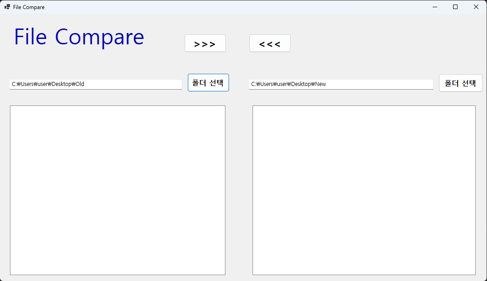
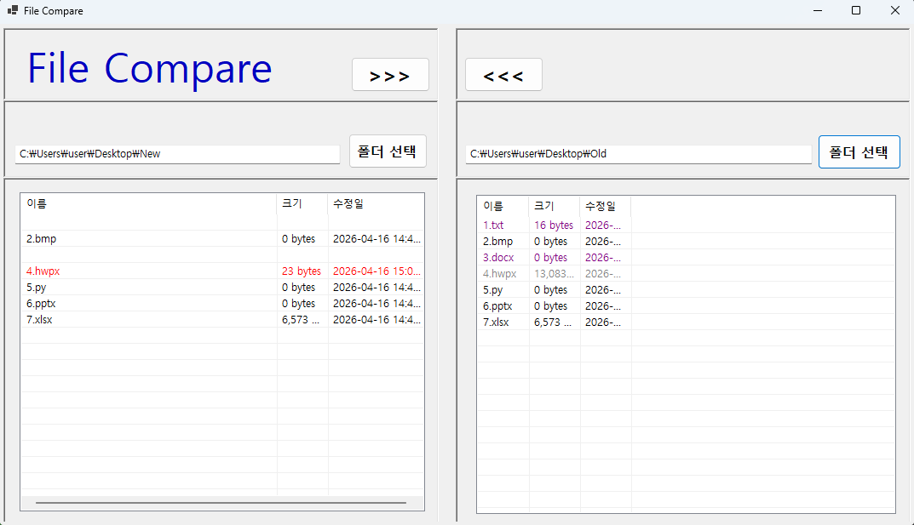
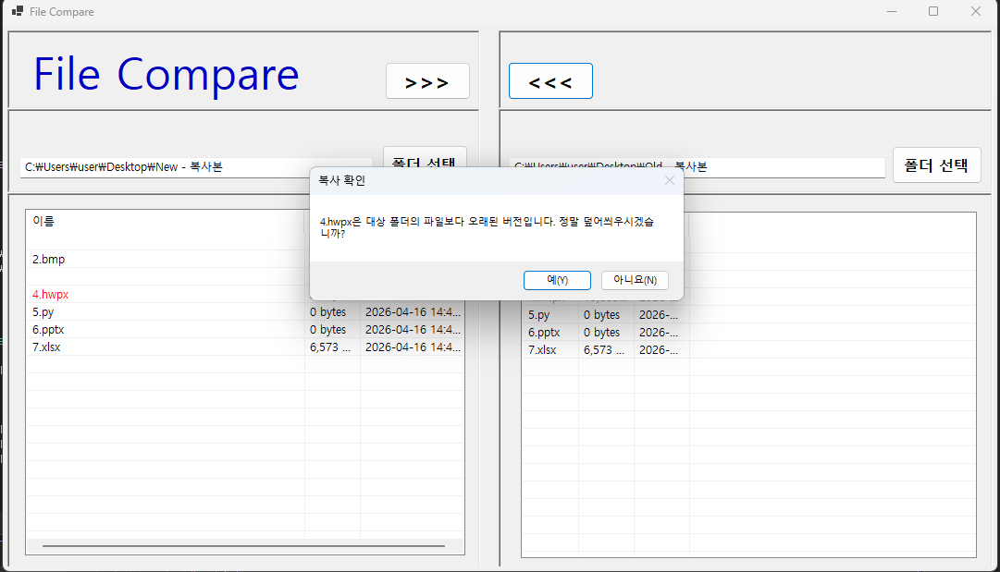
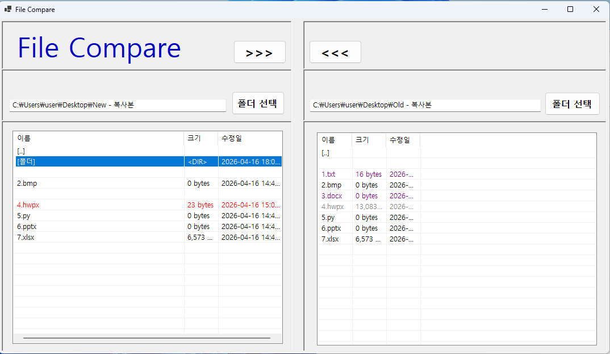

# File Compare
## 개요 - C# 프로그래밍학습
-1줄소개: 서로 다른 파일, 폴더의 비교 프로그램  
-C#, .NET Windows Forms, Visual Studio, GitHub
## 과제1
  
*구현 기능   
	-UI 구성:스플릿 컨테이너, 버튼, 레이블, 리스트뷰, 텍스트박스  
	-구현 기능 : 파일 및 폴더 선택 기능  
## 과제2 
  
*구현 기능  
	1.선택된 폴더의 파일을 리스트 뷰에 출력  
	2.리스트 뷰에 출력된 파일의 상태에 따라 다른 색상으로 표시  
		  -같은 파일 : 파란색  
		  -수정시간의 차이 : 빨간색(최신), 회색(이전)  
		  -없는 파일 : 보라색  

## 과제3  
  
*구현 기능  
	1.양방향 복사기능 구현  
	2.이전 버전의 파일으로 최신버전의 파일을 덮어씌울 시 경고 창 출력  

## 과제4 - 미완성(디버깅 중)
  
*목표기능 : 하위 폴더의 비교 및 UI/UX 개선  